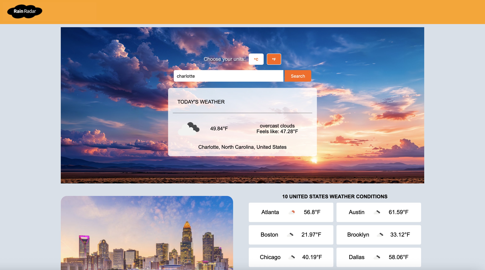

# Weather App

Weather App responsive, and user-friendly application that provides **real-time weather information and forecasts** for any location.  
This project demonstrates **API integration, geocoding, dynamic UI updates, and unit conversion** using weather and location data.

- 👉 Live app: https://wheater-app-4hsf.onrender.com



---

## Features

- **Real-Time Weather Data**

  - Fetches current weather conditions from reliable weather APIs
  - Displays temperature, feels like and weather description

- **Geocoding & Location Support**

  - Convert user-entered addresses into **latitude and longitude coordinates**
  - Automatically fetch weather data for the user’s location

- **Search by City or Coordinates**

  - Users can search weather data using **Address**,**city names** or **Zip Code**

- **Unit Switching (Metric & Imperial)**

  - Toggle between **Celsius/Fahrenheit** for temperature

- **Dynamic and Responsive Design**

  - Optimized for **desktop, tablet, and mobile devices**
  - Smooth UI updates based on API responses

- **Error Handling & Feedback**
  - Alerts users when the location is invalid or data cannot be fetched
  - Ensures smooth and reliable user experience

---

## Technologies Used

- HTML5
- CSS3 (Responsive layouts and modern UI)
- JavaScript (DOM manipulation, API calls, unit conversion)
- Weather APIs (for current weather and forecasts)
- Geocoding APIs (to convert addresses into coordinates)
- JSON (for parsing API responses)

---

## Installation & Usage

1. git clone git@github.com:MassowNdiaye/Wheater-App.git
2. npm install
3. npm start (to run the server)

   ```

   https://wheater-app-4hsf.onrender.com
   ```
